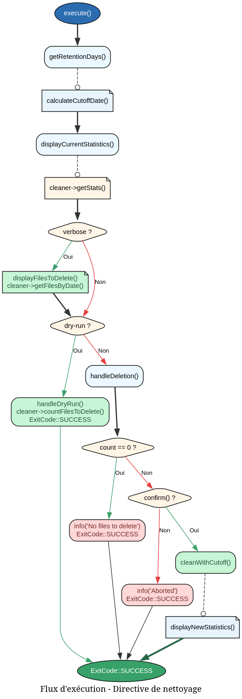

# LoggerCleanDirective - Référence Technique

## Description

Commande CLI pour nettoyer les fichiers de logs obsolètes. Supprime les fichiers JSONL plus anciens que la période de rétention configurée, avec support du mode dry-run et de la sortie verbose.

## Hiérarchie

```
AbstractDirective (andydefer/laravel-directive)
    └── LoggerCleanDirective
```

## Rôle principal

Cette directive permet aux administrateurs système et aux développeurs de gérer l'espace disque en supprimant automatiquement les anciens fichiers de logs. Elle offre :

- Une visualisation des statistiques avant suppression
- Un mode dry-run pour prévisualiser les suppressions
- Une confirmation interactive avant la suppression réelle
- Un mode verbose pour voir quels fichiers seraient affectés

## API / Méthodes publiques

### `getSignature(): string`

Retourne la signature de la directive avec ses options.

| Option | Type | Description |
|--------|------|-------------|
| `--days` | `int` | Nombre de jours à conserver (défaut: 30) |
| `--dry-run` | `flag` | Simule la suppression sans effacer |
| `--verbose` | `flag` | Affiche la liste détaillée des fichiers |

**Exemple :**
```bash
./vendor/bin/directive logger-clean --days=60 --dry-run --verbose
```

### `getDescription(): string`

Retourne la description de la directive.

**Retourne :** `string` - Description lisible par l'utilisateur

### `getAliases(): StringTypedCollection`

Retourne les alias de la directive.

**Retourne :** `StringTypedCollection` - Collection contenant 'log-clean' et 'clean-logs'

**Exemple :**
```bash
./vendor/bin/directive log-clean --dry-run
./vendor/bin/directive clean-logs --days=90
```

### `shouldBootLaravel(): bool`

Indique que Laravel doit être chargé avant l'exécution.

**Retourne :** `true` toujours, car la directive utilise les services de logging.

### `execute(): ExitCode`

Exécute la logique principale de nettoyage.

**Retourne :** `ExitCode::SUCCESS` (0) toujours (les erreurs sont gérées en interne)

## Cas d'utilisation

### Cas 1 : Nettoyage standard avec confirmation

```bash
./vendor/bin/directive logger-clean
```

Sortie typique :
```
Current statistics:
  Files: 45
  Size: 12.5 MB
  Lines: 15230
  Range: 2024-01-01 to 2026-06-01
  Path: /var/www/storage/logs/structured

Delete 15 log(s) older than 2026-05-02? (yes/no) [no]:
 > yes

✓ Deleted 15 file(s)

New statistics:
  Files: 30
  Size: 8.2 MB
```

### Cas 2 : Prévisualisation sans suppression

```bash
./vendor/bin/directive logger-clean --dry-run --verbose
```

Sortie :
```
Current statistics:
  Files: 45
  Size: 12.5 MB
  Lines: 15230
  Range: 2024-01-01 to 2026-06-01
  Path: /var/www/storage/logs/structured

Files to delete:
  - 2024-01-01/00-01 (1024 bytes)
  - 2024-01-01/01-02 (2048 bytes)
  - ... (liste complète)

Dry run mode - no files will be deleted
Would delete files older than 2026-05-02
Would delete 15 file(s)
```

### Cas 3 : Nettoyage avec rétention personnalisée

```bash
./vendor/bin/directive logger-clean --days=7
```

Supprime uniquement les logs plus vieux que 7 jours (utile pour les environnements avec peu d'espace disque).

## Flux d'exécution



## Gestion des erreurs

La directive ne lève pas d'exceptions. Toutes les erreurs (fichier illisible, permission refusée) sont gérées silencieusement par les services sous-jacents.

| Situation | Comportement |
|-----------|--------------|
| Répertoire des logs inexistant | Affiche `Files: 0`, aucune suppression |
| Erreur de lecture d'un fichier | Le fichier est ignoré, les autres sont traités |
| Permission refusée pour supprimer | Le fichier reste sur le disque, `deletedCount` n'incrémente pas |
| Option `--days` non numérique | Utilise la valeur par défaut (30) |

## Intégration

### Dépendances injectées

```php
new LoggerCleanDirective(
    interaction: $interaction,      // DirectiveInteractionService
    cleaner: new LogCleanerService(), // Nettoyage des logs
    pathService: new LogPathService(), // Gestion des chemins
    laravelBootstrapper: $bootstrapper // Bootstrap Laravel
);
```

### Services utilisés

| Service | Rôle |
|---------|------|
| `LogCleanerService` | Statistiques, comptage, suppression |
| `LogPathService` | Configuration des chemins |

## Performance

- **Affichage des statistiques** : O(n) avec n = nombre de fichiers
- **Mode verbose** : O(n) avec n = nombre de fichiers à supprimer
- **Mode dry-run** : O(n) pour compter les fichiers
- **Suppression réelle** : O(n) pour la suppression + O(n) pour la mise à jour des statistiques

Le temps d'exécution est proportionnel au nombre de fichiers de logs.

## Compatibilité

| Dépendance | Version |
|------------|---------|
| PHP | 8.2+ |
| Laravel | 10.x, 11.x, 12.x |
| `laravel-directive` | ^3.5 |

## Exemple complet

```php
<?php

declare(strict_types=1);

use AndyDefer\Directive\Enums\ExitCode;
use AndyDefer\Directive\Testing\InteractsWithDirectives;
use AndyDefer\Logger\Directives\LoggerCleanDirective;
use AndyDefer\Logger\Services\LogCleanerService;
use AndyDefer\Logger\Services\LogPathService;

final class LogCleanupController
{
    use InteractsWithDirectives;

    public function cleanup(): void
    {
        // Setup isolated testing environment
        $this->initDirectiveTesting(bootLaravel: true);
        
        // Create and register directive
        $directive = new LoggerCleanDirective(
            interaction: $this->interaction,
            cleaner: new LogCleanerService(new LogPathService()),
            pathService: new LogPathService(),
            laravelBootstrapper: $this->directiveContainer->make(LaravelBootstrapper::class),
        );
        
        $this->registerDirective($directive);
        
        // Execute with dry-run
        $response = $this->runDirective(LoggerCleanDirective::class, ['--dry-run']);
        
        if ($response->exitCode === ExitCode::SUCCESS) {
            echo "Dry run completed: " . $response->output;
        }
        
        // Cleanup
        $this->destroyDirectiveTesting();
    }
}
```
---