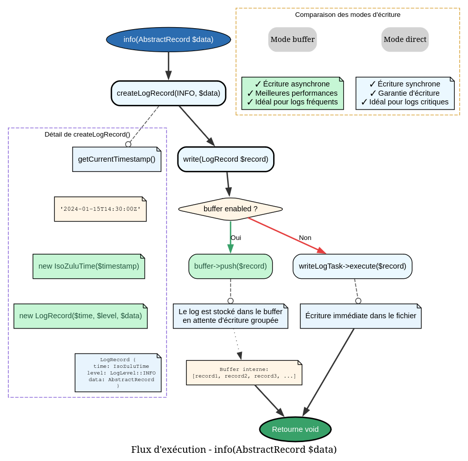
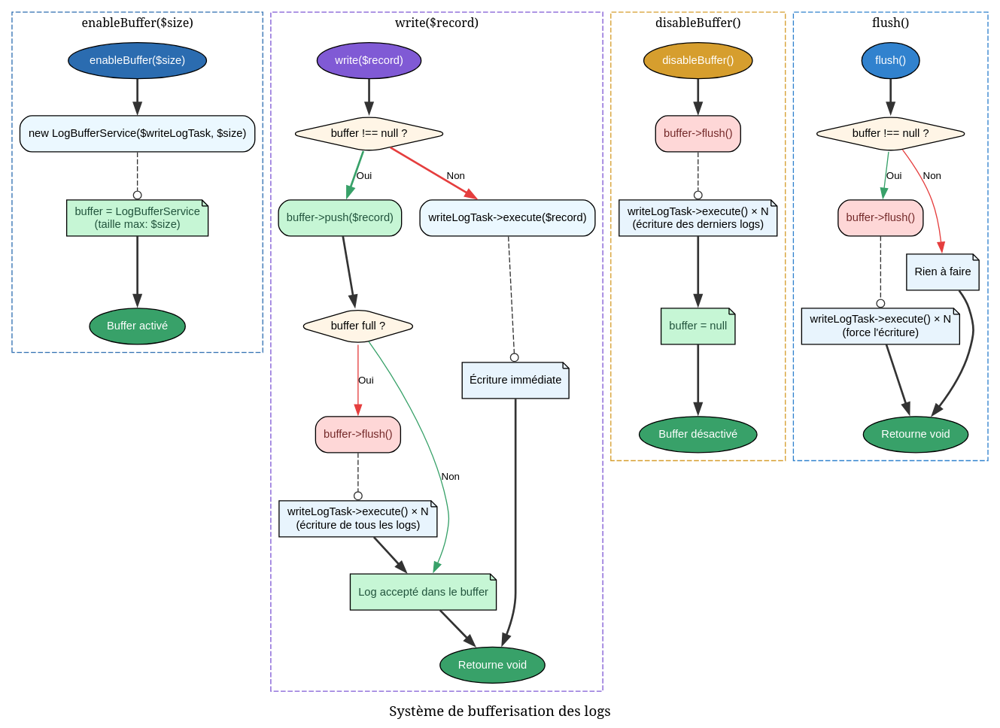
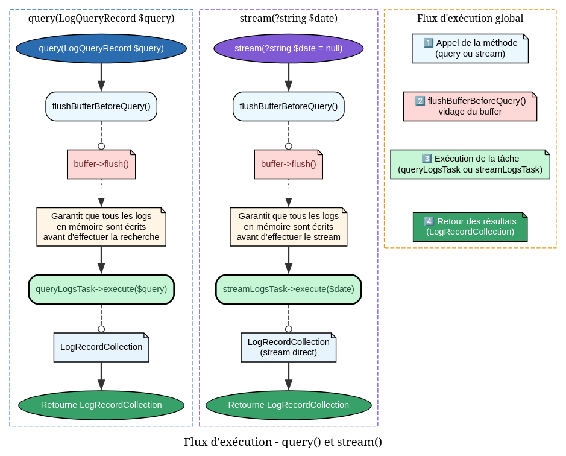

# Logger - Référence Technique

## Description

Logger structuré avec support optionnel de bufferisation. Fournit des méthodes pour écrire des logs à différents niveaux de sévérité, interroger les logs existants et streamer les fichiers de logs.

## Hiérarchie

```
LoggerInterface
    └── Logger (final)
```

## Rôle principal

Cette classe est le point d'entrée principal du package de logging :

- **Écriture de logs** : Méthodes dédiées par niveau (`info()`, `warning()`, `error()`, `debug()`)
- **Bufferisation** : Accumulation des logs en mémoire pour optimiser les performances
- **Interrogation** : Recherche de logs avec filtres (date, type, niveau)
- **Streaming** : Lecture complète des logs d'une journée

## Installation

Le logger est automatiquement instancié par le `LoggerServiceProvider` :

```php
$logger = app(LoggerInterface::class);
```

## API / Méthodes publiques

### `__construct(WriteLogTask $writeLogTask, QueryLogsTask $queryLogsTask, StreamLogsTask $streamLogsTask): self`

| Paramètre | Type | Description |
|-----------|------|-------------|
| `$writeLogTask` | `WriteLogTask` | Tâche d'écriture des logs |
| `$queryLogsTask` | `QueryLogsTask` | Tâche d'interrogation des logs |
| `$streamLogsTask` | `StreamLogsTask` | Tâche de streaming des logs |

### `enableBuffer(int $size = 100): self`

Active le mode buffer pour de meilleures performances.

| Paramètre | Type | Description |
|-----------|------|-------------|
| `$size` | `int` | Nombre de logs avant flush automatique (défaut: 100) |

**Retourne :** `self` - Pour le chaînage

**Exemple :**
```php
$logger->enableBuffer(50);
```

### `disableBuffer(): self`

Désactive le mode buffer et écrit immédiatement tous les logs en attente.

**Retourne :** `self` - Pour le chaînage

### `flush(): void`

Force l'écriture immédiate de tous les logs bufferisés.

### `isBufferEnabled(): bool`

Vérifie si le mode buffer est actif.

**Retourne :** `bool` - `true` si le buffer est activé

### `getBufferSize(): int`

Retourne la capacité du buffer (0 si buffer désactivé).

**Retourne :** `int` - Capacité du buffer

### `log(LogRecord $record): void`

Écrit un enregistrement de log complet.

| Paramètre | Type | Description |
|-----------|------|-------------|
| `$record` | `LogRecord` | Enregistrement à écrire |

### `info(AbstractRecord $data): void`

Écrit un log de niveau INFO.

| Paramètre | Type | Description |
|-----------|------|-------------|
| `$data` | `AbstractRecord` | Données du log |

### `warning(AbstractRecord $data): void`

Écrit un log de niveau WARNING.

| Paramètre | Type | Description |
|-----------|------|-------------|
| `$data` | `AbstractRecord` | Données du log |

### `error(AbstractRecord $data): void`

Écrit un log de niveau ERROR.

| Paramètre | Type | Description |
|-----------|------|-------------|
| `$data` | `AbstractRecord` | Données du log |

### `debug(AbstractRecord $data): void`

Écrit un log de niveau DEBUG.

| Paramètre | Type | Description |
|-----------|------|-------------|
| `$data` | `AbstractRecord` | Données du log |

### `query(LogQueryRecord $query): TypedCollection`

Interroge les logs selon des critères de recherche.

| Paramètre | Type | Description |
|-----------|------|-------------|
| `$query` | `LogQueryRecord` | Critères de recherche (dates, type, niveau) |

**Retourne :** `TypedCollection<LogRecord>` - Collection des logs correspondants

### `stream(?string $date = null): TypedCollection`

Stream tous les logs d'une date spécifique.

| Paramètre | Type | Description |
|-----------|------|-------------|
| `$date` | `string|null` | Date au format `YYYY-MM-DD` (utilise la date du jour si null) |

**Retourne :** `TypedCollection<LogRecord>` - Collection de tous les logs de la date

## Cas d'utilisation

### Cas 1 : Écriture simple de logs

```php
use AndyDefer\Logger\Records\LogDataRecord;
use AndyDefer\DomainStructures\Utils\StrictDataObject;

$payload = new StrictDataObject([
    'user_id' => 123,
    'action' => 'login',
]);

$logData = new LogDataRecord(type: 'authentication', payload: $payload);

$logger->info($logData);
$logger->warning($logData);
$logger->error($logData);
$logger->debug($logData);
```

### Cas 2 : Bufferisation pour haute performance

```php
// Activer le buffer avec capacité de 500 logs
$logger->enableBuffer(500);

for ($i = 0; $i < 1000; $i++) {
    $logger->info($logData); // Pas d'écriture disque immédiate
}

// Flush manuel (ou auto-flush à 500)
$logger->flush();
```

### Cas 3 : Interrogation des logs

```php
use AndyDefer\Logger\Records\LogQueryRecord;
use AndyDefer\Logger\ValueObjects\IsoZuluTime;

$from = new IsoZuluTime('2024-01-01T00:00:00Z');
$to = new IsoZuluTime('2024-01-31T23:59:59Z');

$query = new LogQueryRecord(
    from: $from,
    to: $to,
    type: 'payment_failed',
    level: LogLevel::ERROR,
);

$failedPayments = $logger->query($query);

foreach ($failedPayments as $log) {
    echo $log->time->getValue() . ": " . $log->data->payload->payment_id . "\n";
}
```

### Cas 4 : Streaming des logs d'une journée

```php
// Logs d'aujourd'hui
$todayLogs = $logger->stream();

// Logs d'une date spécifique
$logs = $logger->stream('2024-01-15');

echo "Total logs: {$logs->count()}\n";
```

### Cas 5 : Export des logs en JSON

```php
$logs = $logger->stream('2024-01-15');
$export = [];

foreach ($logs as $log) {
    $export[] = [
        'time' => $log->time->getValue(),
        'level' => $log->level->value,
        'type' => $log->data->type,
        'payload' => $log->data->payload->toArray(),
    ];
}

file_put_contents('export.json', json_encode($export, JSON_PRETTY_PRINT));
```

## Flux d'exécution

### Écriture d'un log



### Bufferisation



### Interrogation et streaming



## Gestion des erreurs

| Situation | Comportement |
|-----------|--------------|
| Buffer activé | Les logs sont accumulés en mémoire |
| Buffer plein | Auto-flush déclenché |
| Erreur d'écriture | Exception propagée par `WriteLogTask` |
| Requête sans résultats | Collection vide retournée |

## Performance

| Mode | Latence | Throughput | Usage mémoire |
|------|---------|------------|---------------|
| Direct (buffer désactivé) | Élevée (I/O synchrone) | Faible | Minimale |
| Bufferisé | Faible (écriture asynchrone) | Élevé | O(n) avec n = taille buffer |

**Recommandations :**
- Buffer pour les écritures en masse (>100 logs)
- Direct pour les logs critiques nécessitant une persistance immédiate
- Ajuster la taille du buffer selon la mémoire disponible

## Compatibilité

| Version PHP | Support |
|-------------|---------|
| PHP 8.2+ | ✅ Complet |
| PHP 8.1 | ✅ Complet |

| Dépendance | Version |
|------------|---------|
| `andydefer/laravel-logger` | ≥ 1.0 |
| `WriteLogTask` | Compatible |
| `QueryLogsTask` | Compatible |
| `StreamLogsTask` | Compatible |
| `LogBufferService` | Compatible |

## Exemple complet

```php
<?php

declare(strict_types=1);

use AndyDefer\Logger\Logger;
use AndyDefer\Logger\Records\LogDataRecord;
use AndyDefer\Logger\Records\LogQueryRecord;
use AndyDefer\Logger\ValueObjects\IsoZuluTime;
use AndyDefer\Logger\Enums\LogLevel;
use AndyDefer\DomainStructures\Utils\StrictDataObject;

// Configuration via Service Provider
$logger = app(LoggerInterface::class);

// 1. Écrire des logs
$payload = new StrictDataObject(['user_id' => 123, 'action' => 'login']);
$logData = new LogDataRecord(type: 'auth', payload: $payload);

$logger->info($logData);
$logger->error($logData);

// 2. Mode buffer pour haute performance
$logger->enableBuffer(200);
for ($i = 0; $i < 500; $i++) {
    $logger->debug($logData);
}
$logger->flush(); // Écriture finale
$logger->disableBuffer();

// 3. Interroger les logs d'erreur du mois
$from = new IsoZuluTime('2024-01-01T00:00:00Z');
$to = new IsoZuluTime('2024-01-31T23:59:59Z');
$query = new LogQueryRecord($from, $to, null, LogLevel::ERROR);

$errors = $logger->query($query);
echo "Errors in January: {$errors->count()}\n";

// 4. Streamer tous les logs d'aujourd'hui
$todayLogs = $logger->stream();
echo "Today's logs: {$todayLogs->count()}\n";

foreach ($todayLogs as $log) {
    echo "[{$log->time->getValue()}] {$log->data->type}\n";
}
```
---