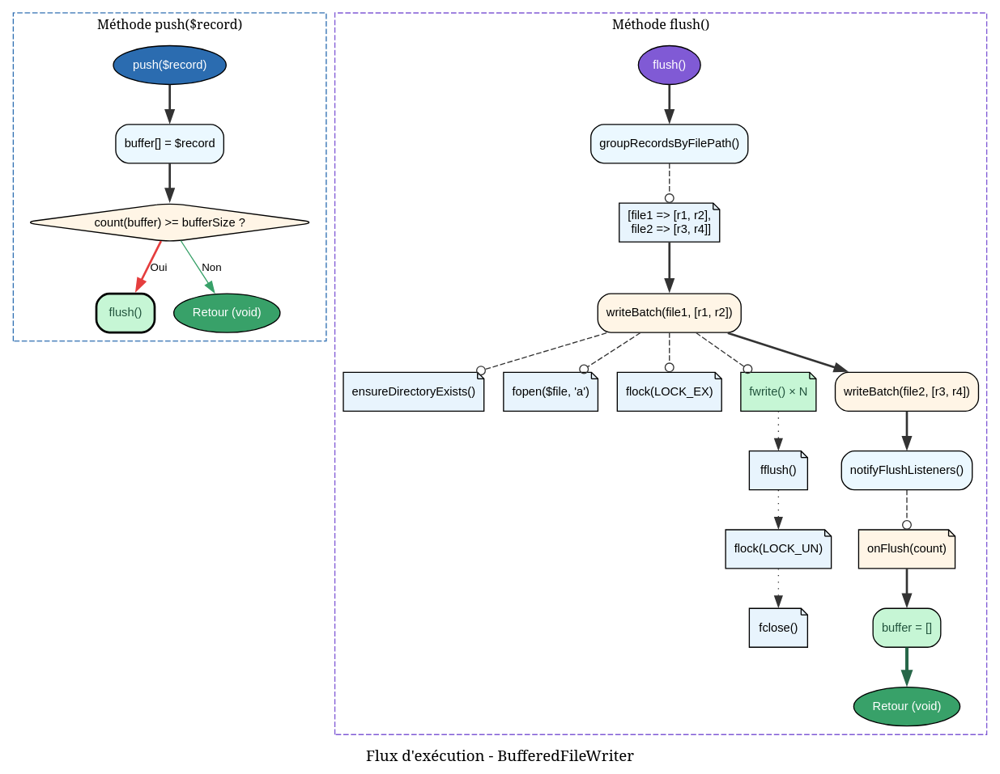

```markdown
---
title: "LogBufferService"
category: "Service"
order: 2
---

# LogBufferService - Référence Technique

## Description

Service de bufferisation pour les enregistrements de logs. Accumule les logs en mémoire et les écrit par lots sur le disque pour optimiser les performances.

## Hiérarchie

```
Service
    └── LogBufferService
```

## Rôle principal

Ce service résout le problème d'écriture intensive des logs. Au lieu d'écrire chaque log individuellement sur le disque (opération coûteuse), il accumule les logs en mémoire et les écrit en groupe :

- **Performance** : Réduction drastique des opérations d'entrée/sortie
- **Atomicité** : Écriture groupée avec verrouillage exclusif
- **Optimisation** : Regroupement par fichier pour minimiser les ouvertures/fermetures

## Installation

Ce service est automatiquement instancié par le `LoggerServiceProvider`. Aucune installation manuelle requise.

## API / Méthodes publiques

### `__construct(WriteLogTask $writeTask, int $bufferSize = 100): self`

| Paramètre | Type | Description |
|-----------|------|-------------|
| `$writeTask` | `WriteLogTask` | Tâche d'écriture responsable de la sérialisation |
| `$bufferSize` | `int` | Capacité maximale du buffer (défaut: 100) |

### `push(LogRecord $record): void`

Ajoute un enregistrement au buffer. Déclenche automatiquement un flush si la capacité est atteinte.

| Paramètre | Type | Description |
|-----------|------|-------------|
| `$record` | `LogRecord` | Enregistrement à bufferiser |

**Exemple :**
```php
$record = new LogRecord(/* ... */);
$buffer->push($record);
```

### `flush(): void`

Écrit immédiatement tous les enregistrements bufferisés sur le disque.

- Regroupe les logs par fichier de destination
- Acquiert un verrou exclusif (`LOCK_EX`) pour chaque fichier
- Écrit les logs en batch
- Libère le verrou
- Vide le buffer

**Exemple :**
```php
$buffer->flush(); // Écriture forcée
```

### `onFlush(Closure $callback): self`

Enregistre un callback exécuté après chaque flush.

| Paramètre | Type | Description |
|-----------|------|-------------|
| `$callback` | `Closure(int): void` | Callback recevant le nombre de logs flushés |

**Retourne :** `self` - Pour le chaînage

**Exemple :**
```php
$buffer->onFlush(function ($count) {
    echo "Flushed {$count} logs\n";
});
```

### `size(): int`

**Retourne :** `int` - Nombre d'enregistrements actuellement dans le buffer

### `isDirty(): bool`

**Retourne :** `bool` - `true` si le buffer contient des enregistrements non écrits

### `getBufferSize(): int`

**Retourne :** `int` - Capacité maximale du buffer

### `setBufferSize(int $size): self`

Modifie la capacité du buffer. Si la nouvelle capacité est inférieure au nombre actuel d'enregistrements, un flush est automatiquement déclenché.

| Paramètre | Type | Description |
|-----------|------|-------------|
| `$size` | `int` | Nouvelle capacité |

**Retourne :** `self` - Pour le chaînage

### `__destruct()`

Le destructeur garantit que tous les logs bufferisés sont écrits avant que l'objet ne soit détruit.

## Cas d'utilisation

### Cas 1 : Bufferisation par défaut (taille 100)

```php
// Dans LoggerServiceProvider
$buffer = new LogBufferService($writeTask, 100);

for ($i = 0; $i < 150; $i++) {
    $buffer->push($record);
    // Après 100 pushes, flush automatique
    // Les 50 restants sont bufferisés
}
```

### Cas 2 : Écriture forcée avant une opération critique

```php
$buffer->push($record1);
$buffer->push($record2);

// Opération qui dépend des logs écrits
$buffer->flush(); // Garantit que les logs sont sur disque

$this->criticalOperation();
```

### Cas 3 : Surveillance des performances

```php
$buffer->onFlush(function ($count) use ($logger) {
    $logger->debug("Buffer flush", ['count' => $count]);
});

// Chaque flush sera logguée
for ($i = 0; $i < 1000; $i++) {
    $buffer->push($record);
}
```

### Cas 4 : Ajustement dynamique de la capacité

```php
// Période de forte charge : buffer plus grand
$buffer->setBufferSize(500);

// Période calme : buffer plus petit (flush auto si besoin)
$buffer->setBufferSize(50);
```

## Flux d'exécution




## Gestion des erreurs

Le service privilégie la robustesse : aucune exception n'est levée. Les erreurs sont silencieusement ignorées.

| Situation | Comportement |
|-----------|--------------|
| Répertoire inexistant | Tentative de création avec `@mkdir()` |
| Échec de création du répertoire | La batch est ignorée, logs perdus |
| Fichier illisible/verrouillé | `@fopen()` échoue, batch ignorée |
| Échec du verrou (`flock`) | Batch ignorée |
| Échec d'écriture (`fwrite`) | L'erreur est ignorée, execution continue |
| Chemin invalide (`/`, `.`, vide) | Batch ignorée |

**Remarque :** En production, ces erreurs silencieuses peuvent masquer des problèmes (disque plein, permissions). Une amélioration possible serait d'ajouter un logger optionnel.

## Intégration

### Avec WriteLogTask

```php
// WriteLogTask fournit :
// - getFilePath($timestamp) : Calcule le chemin du fichier
// - serialize($record) : Sérialise en JSONL
```

### Dans Logger (utilisation complète)

```php
final class Logger implements LoggerInterface
{
    private ?LogBufferService $buffer = null;
    
    public function enableBuffer(int $size = 100): void
    {
        $this->buffer = new LogBufferService($this->writeTask, $size);
    }
    
    private function write(LogRecord $record): void
    {
        if ($this->buffer !== null) {
            $this->buffer->push($record);
        } else {
            $this->writeTask->execute($record);
        }
    }
}
```

## Performance

| Opération | Complexité | Notes |
|-----------|------------|-------|
| `push()` | O(1) | Simple ajout en tableau |
| `flush()` | O(n × m) | n = records, m = fichiers uniques |
| Regroupement | O(n) | Parcours unique du buffer |
| Écriture batch | O(r) | r = records par fichier |

**Gains attendus :**

- **Sans buffer** : 10 000 logs → 10 000 écritures fichier
- **Avec buffer (taille 100)** : 10 000 logs → 100 écritures fichier (×100 moins)

## Compatibilité

| Version PHP | Support |
|-------------|---------|
| PHP 8.2+ | ✅ Complet |
| PHP 8.1 | ✅ Complet |

| Dépendance | Version |
|------------|---------|
| `andydefer/laravel-logger` | ≥ 1.0 |
| `WriteLogTask` | Compatible |

## Exemple complet

```php
<?php

declare(strict_types=1);

use AndyDefer\Logger\Services\LogBufferService;
use AndyDefer\Logger\Services\LogPathService;
use AndyDefer\Logger\Services\LogSerializerService;
use AndyDefer\Logger\Tasks\WriteLogTask;
use AndyDefer\Logger\ValueObjects\LoggerConfig;

// Configuration
$config = new LoggerConfig('/var/log/myapp', 30);
$pathService = new LogPathService($config);
$serializer = new LogSerializerService();
$writeTask = new WriteLogTask($pathService, $serializer);

// Buffer de 50 logs
$buffer = new LogBufferService($writeTask, 50);

// Callback de monitoring
$buffer->onFlush(function ($count) {
    echo "[" . date('H:i:s') . "] Flushed {$count} logs\n";
});

// Simulation de charge
for ($i = 0; $i < 200; $i++) {
    $record = new LogRecord(/* ... */);
    $buffer->push($record);
    
    if ($i % 10 === 0) {
        echo "Buffered {$i} logs\n";
    }
}

// Nettoyage explicite
$buffer->flush();

// Sortie :
// [10:00:01] Buffered 0 logs
// [10:00:02] Flushed 50 logs
// [10:00:03] Buffered 10 logs
// [10:00:04] Flushed 50 logs
// ...
```
---