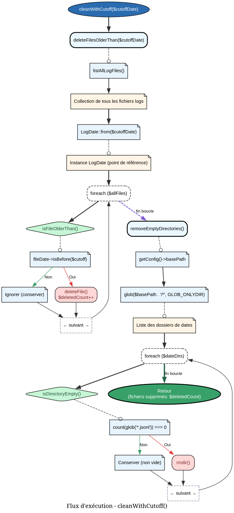
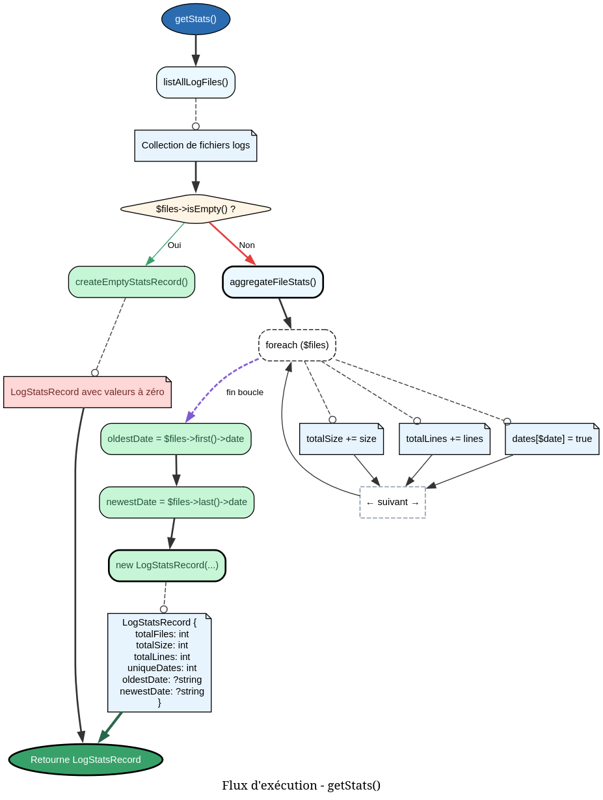

```markdown
---
title: "LogCleanerService"
category: "Service"
order: 3
---

# LogCleanerService - Référence Technique

## Description

Service de nettoyage et d'analyse des fichiers de logs. Supprime les fichiers obsolètes, compte les fichiers à supprimer et génère des statistiques détaillées sur l'ensemble des logs.

## Hiérarchie

```
Service
    └── LogCleanerService (final)
```

## Rôle principal

Ce service centralise toutes les opérations de maintenance sur les fichiers de logs :

- **Nettoyage** : Suppression des fichiers plus anciens qu'une date de coupure
- **Analyse** : Calcul de statistiques (taille, nombre de lignes, répartition par date)
- **Comptage** : Prévisualisation des fichiers qui seraient supprimés
- **Maintenance** : Nettoyage automatique des répertoires devenus vides

## API / Méthodes publiques

### `__construct(LogPathService $pathService): self`

| Paramètre | Type | Description |
|-----------|------|-------------|
| `$pathService` | `LogPathService` | Service de gestion des chemins et opérations fichiers |

### `clean(): int`

Supprime les logs anciens en utilisant la période de rétention configurée dans `LoggerConfig`.

**Retourne :** `int` - Nombre de fichiers supprimés

**Exemple :**
```php
$deletedCount = $cleaner->clean();
echo "Deleted {$deletedCount} log files";
```

### `cleanWithCutoff(string $cutoffDate): int`

Supprime tous les logs plus anciens qu'une date spécifique.

| Paramètre | Type | Description |
|-----------|------|-------------|
| `$cutoffDate` | `string` | Date de coupure au format `YYYY-MM-DD` |

**Retourne :** `int` - Nombre de fichiers supprimés

**Exemple :**
```php
// Supprime les logs antérieurs au 1er janvier 2024
$deletedCount = $cleaner->cleanWithCutoff('2024-01-01');
```

### `countFilesToDelete(string $cutoffDate): int`

Compte le nombre de fichiers qui seraient supprimés avec une date de coupure donnée. Utile pour la prévisualisation (mode dry-run).

| Paramètre | Type | Description |
|-----------|------|-------------|
| `$cutoffDate` | `string` | Date de coupure au format `YYYY-MM-DD` |

**Retourne :** `int` - Nombre de fichiers qui seraient supprimés

**Exemple :**
```php
$count = $cleaner->countFilesToDelete('2024-01-01');
echo "Would delete {$count} files";
```

### `getStats(): LogStatsRecord`

Calcule des statistiques complètes sur l'ensemble des fichiers de logs.

**Retourne :** `LogStatsRecord` - Objet contenant :
- `totalFiles` : Nombre total de fichiers
- `totalDays` : Nombre de jours distincts
- `totalSizeBytes` : Taille totale en octets
- `totalSizeMb` : Taille totale en mégaoctets (arrondi à 2 décimales)
- `totalLines` : Nombre total de lignes
- `oldestDate` : Date la plus ancienne (`YYYY-MM-DD` ou `null`)
- `newestDate` : Date la plus récente (`YYYY-MM-DD` ou `null`)

**Exemple :**
```php
$stats = $cleaner->getStats();

echo "Total files: {$stats->totalFiles}\n";
echo "Total size: {$stats->totalSizeMb} MB\n";
echo "Date range: {$stats->oldestDate} to {$stats->newestDate}\n";
```

### `getFilesByDate(string $date): LogFileInfoCollection`

Récupère tous les fichiers de logs pour une date spécifique.

| Paramètre | Type | Description |
|-----------|------|-------------|
| `$date` | `string` | Date au format `YYYY-MM-DD` |

**Retourne :** `LogFileInfoCollection` - Collection d'objets `LogFileInfoRecord`

**Exemple :**
```php
$files = $cleaner->getFilesByDate('2024-01-15');

foreach ($files as $file) {
    echo "{$file->date}/{$file->hour}: {$file->size} bytes\n";
}
```

### `getTotalSize(): int`

Calcule la taille totale de tous les fichiers de logs.

**Retourne :** `int` - Taille totale en octets

**Exemple :**
```php
$totalBytes = $cleaner->getTotalSize();
$totalMb = round($totalBytes / 1024 / 1024, 2);
echo "Total logs size: {$totalMb} MB";
```

## Cas d'utilisation

### Cas 1 : Nettoyage programmé (cron)

```php
// Script de nettoyage quotidien
$cleaner = app(LogCleanerService::class);

$deleted = $cleaner->clean();
$stats = $cleaner->getStats();

logger()->info("Log cleanup completed", [
    'deleted_files' => $deleted,
    'remaining_files' => $stats->totalFiles,
    'total_size_mb' => $stats->totalSizeMb,
]);
```

### Cas 2 : Prévisualisation avant suppression (dry-run)

```php
// Interface CLI
$cutoffDate = date('Y-m-d', strtotime('-30 days'));
$toDelete = $cleaner->countFilesToDelete($cutoffDate);

if ($toDelete > 0) {
    echo "Would delete {$toDelete} files older than {$cutoffDate}\n";
    
    if ($this->confirm('Proceed with deletion?')) {
        $deleted = $cleaner->cleanWithCutoff($cutoffDate);
        echo "Deleted {$deleted} files\n";
    }
}
```

### Cas 3 : Rapport de santé des logs

```php
class LogHealthCheck
{
    public function generateReport(): array
    {
        $stats = $this->cleaner->getStats();
        
        return [
            'status' => $this->determineStatus($stats),
            'metrics' => [
                'total_files' => $stats->totalFiles,
                'total_size_mb' => $stats->totalSizeMb,
                'oldest_log' => $stats->oldestDate,
                'newest_log' => $stats->newestDate,
                'daily_average_mb' => $stats->totalDays > 0 
                    ? round($stats->totalSizeMb / $stats->totalDays, 2) 
                    : 0,
            ],
            'recommendations' => $this->getRecommendations($stats),
        ];
    }
}
```

### Cas 4 : Nettoyage sélectif par date

```php
// Conserver uniquement les 3 derniers mois
$threeMonthsAgo = date('Y-m-d', strtotime('-90 days'));

// Simuler d'abord
$toDelete = $cleaner->countFilesToDelete($threeMonthsAgo);
echo "Files to delete: {$toDelete}\n";

// Puis supprimer
$deleted = $cleaner->cleanWithCutoff($threeMonthsAgo);
echo "Deleted: {$deleted}\n";

// Vérifier le résultat
$stats = $cleaner->getStats();
echo "Remaining files: {$stats->totalFiles}\n";
echo "Oldest remaining: {$stats->oldestDate}\n";
```

## Flux d'exécution

### Nettoyage avec date de coupure (`cleanWithCutoff`)



### Calcul des statistiques (`getStats`)



## Gestion des erreurs

Le service privilégie la robustesse : les erreurs sont silencieusement ignorées pour ne pas interrompre le flux principal.

| Situation | Comportement | Impact |
|-----------|--------------|--------|
| Fichier illisible lors de la suppression | `unlink()` échoue silencieusement | Compteur de suppression n'incrémente pas |
| Répertoire de base inexistant | `is_dir()` retourne false, fonction ignorée | Aucun nettoyage effectué |
| Permission refusée pour rmdir | `rmdir()` échoue | Le répertoire reste sur le disque |
| Aucun fichier trouvé | `getStats()` retourne des valeurs à zéro | Appelant reçoit des données cohérentes |
| Collection vide pour `first()`/`last()` | `?->date` retourne `null` | Statistiques à null pour dates |

## Intégration

### Dépendances

```
LogCleanerService
    └── LogPathService (injecté)
            ├── LoggerConfig
            ├── glob() / is_dir() / rmdir()
            └── LogFileInfoCollection
```

### Utilisation dans une Directive

```php
final class LoggerCleanDirective extends AbstractDirective
{
    public function __construct(
        private readonly LogCleanerService $cleaner,
        // ...
    ) {}
    
    public function execute(): ExitCode
    {
        $cutoffDate = date('Y-m-d', strtotime('-30 days'));
        $toDelete = $this->cleaner->countFilesToDelete($cutoffDate);
        
        if ($toDelete === 0) {
            $this->info('No files to delete.');
            return ExitCode::SUCCESS;
        }
        
        $deleted = $this->cleaner->cleanWithCutoff($cutoffDate);
        $this->info("Deleted {$deleted} files.");
        
        return ExitCode::SUCCESS;
    }
}
```

### Utilisation dans un Artisan Command

```php
use AndyDefer\Logger\Services\LogCleanerService;

class LogCleanCommand extends Command
{
    public function handle(LogCleanerService $cleaner): int
    {
        $dryRun = $this->option('dry-run');
        $cutoffDate = date('Y-m-d', strtotime('-30 days'));
        
        if ($dryRun) {
            $count = $cleaner->countFilesToDelete($cutoffDate);
            $this->info("Would delete {$count} files.");
            return 0;
        }
        
        $deleted = $cleaner->cleanWithCutoff($cutoffDate);
        $this->info("Deleted {$deleted} files.");
        
        return 0;
    }
}
```

## Performance

| Opération | Complexité | Cache |
|-----------|------------|-------|
| `countFilesToDelete()` | O(n) | Non |
| `cleanWithCutoff()` | O(n) + O(d) | Non |
| `getStats()` | O(n) | Non |
| `getFilesByDate()` | O(f) avec f = fichiers du jour | Non |
| `getTotalSize()` | O(n) | Non |

- **n** = nombre total de fichiers logs
- **d** = nombre de répertoires de dates
- **f** = nombre de fichiers pour une date donnée

**Recommandations :**
- Pour des millions de fichiers, envisager un cache des métriques
- Le nettoyage peut être long sur disques réseau
- Planifier l'exécution pendant les heures creuses

## Compatibilité

| Version PHP | Support |
|-------------|---------|
| PHP 8.2+ | ✅ Complet |
| PHP 8.1 | ✅ Complet |

| Dépendance | Version |
|------------|---------|
| `andydefer/laravel-logger` | ≥ 1.0 |
| `LogPathService` | Compatible |
| `LogDate` (Value Object) | ≥ 1.0 |

## Exemple complet

```php
<?php

declare(strict_types=1);

use AndyDefer\Logger\Services\LogCleanerService;
use AndyDefer\Logger\Services\LogPathService;
use AndyDefer\Logger\ValueObjects\LoggerConfig;

// Configuration
$config = new LoggerConfig('/var/log/myapp', retentionDays: 30);
$pathService = new LogPathService($config);
$cleaner = new LogCleanerService($pathService);

// 1. Afficher les statistiques actuelles
$stats = $cleaner->getStats();
echo "=== Log Statistics ===\n";
echo "Files: {$stats->totalFiles}\n";
echo "Size: {$stats->totalSizeMb} MB\n";
echo "Lines: {$stats->totalLines}\n";
echo "Range: {$stats->oldestDate} → {$stats->newestDate}\n\n";

// 2. Simuler le nettoyage des logs de plus de 60 jours
$cutoffDate = date('Y-m-d', strtotime('-60 days'));
$toDelete = $cleaner->countFilesToDelete($cutoffDate);
echo "Files older than {$cutoffDate}: {$toDelete}\n\n";

// 3. Nettoyer uniquement si plus de 100 fichiers
if ($toDelete > 100) {
    echo "Proceeding with cleanup...\n";
    $deleted = $cleaner->cleanWithCutoff($cutoffDate);
    echo "Deleted {$deleted} files.\n";
    
    // 4. Afficher les nouvelles statistiques
    $newStats = $cleaner->getStats();
    echo "\n=== After Cleanup ===\n";
    echo "Files remaining: {$newStats->totalFiles}\n";
    echo "Size remaining: {$newStats->totalSizeMb} MB\n";
} else {
    echo "No cleanup needed.\n";
}

// Sortie typique :
// === Log Statistics ===
// Files: 1250
// Size: 456.78 MB
// Lines: 1250000
// Range: 2024-01-01 → 2026-06-01
//
// Files older than 2026-04-02: 350
//
// Proceeding with cleanup...
// Deleted 350 files.
//
// === After Cleanup ===
// Files remaining: 900
// Size remaining: 312.45 MB
```
---