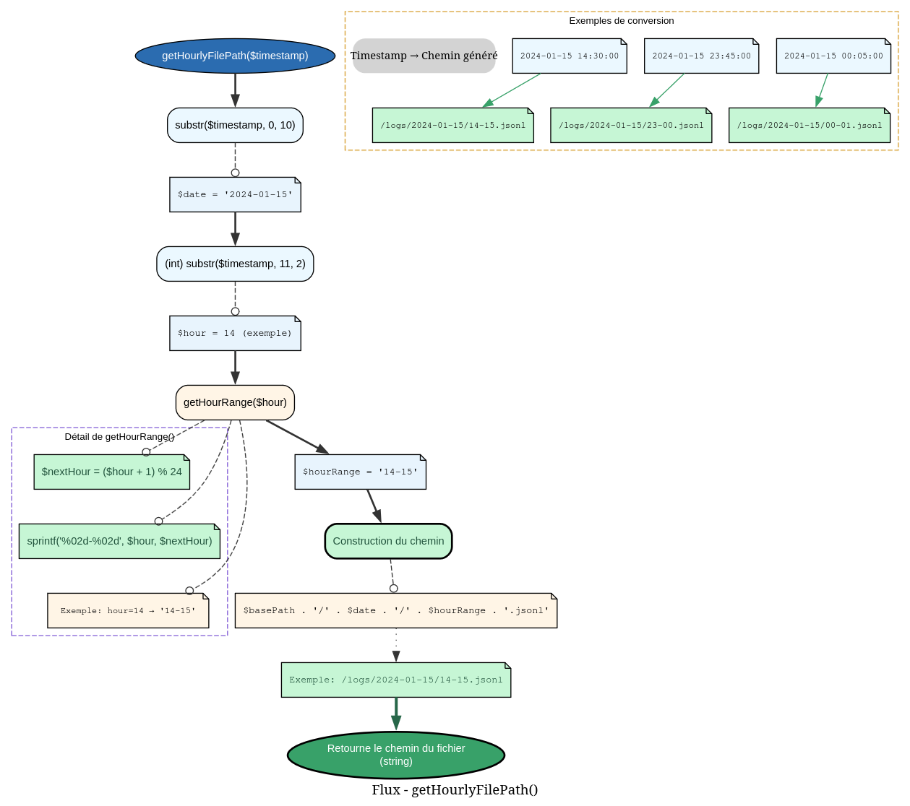
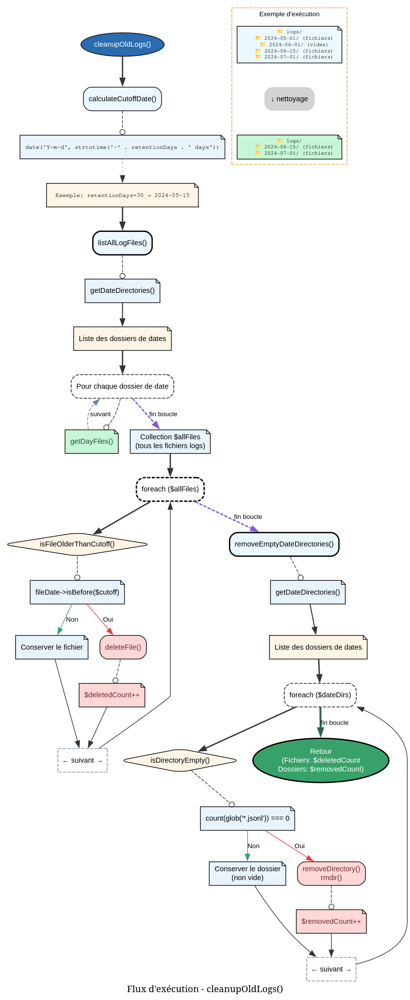
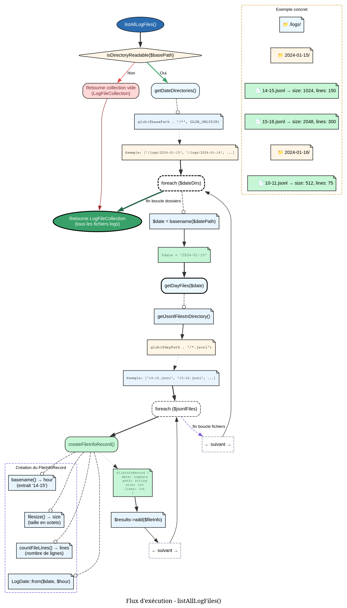

# LogPathService - Référence Technique

## Description

Service de gestion des chemins de fichiers logs et des opérations sur le système de fichiers. Génère les chemins horaires, scanne les répertoires, récupère les métadonnées des fichiers et nettoie les logs obsolètes.

## Hiérarchie

```
Service
    └── LogPathService (final)
```

## Rôle principal

Ce service centralise toutes les interactions avec le système de fichiers pour les logs :

- **Génération de chemins** : Construction des chemins basés sur les timestamps (format `YYYY-MM-DD/HH-HH.jsonl`)
- **Exploration** : Scan des répertoires pour lister les fichiers par date ou globalement
- **Métadonnées** : Récupération de la taille, du nombre de lignes et des informations horaires
- **Nettoyage** : Suppression des fichiers anciens et des répertoires vides

## Installation

Ce service est automatiquement instancié par le `LoggerServiceProvider` avec la configuration par défaut ou celle du fichier `config/logger.php`.

## API / Méthodes publiques

### `__construct(?LoggerConfig $config = null): self`

| Paramètre | Type | Description |
|-----------|------|-------------|
| `$config` | `LoggerConfig|null` | Configuration (utilise les valeurs par défaut si null) |

### `getConfig(): LoggerConfig`

Retourne la configuration actuelle du logger.

**Retourne :** `LoggerConfig` - Configuration (basePath, retentionDays)

### `getHourlyFilePath(IsoZuluTime $timestamp): string`

Génère le chemin absolu du fichier log pour un timestamp donné.

| Paramètre | Type | Description |
|-----------|------|-------------|
| `$timestamp` | `IsoZuluTime` | Timestamp ISO 8601 Zulu |

**Retourne :** `string` - Chemin absolu du fichier

**Format :** `{basePath}/{YYYY-MM-DD}/{HH}-{HH+1}.jsonl`

**Règle de bucketisation :**
- Heures groupées par paires : 00-01, 01-02, ..., 23-00
- Tous les logs d'une même heure tombent dans le même fichier

**Exemple :**
```php
$time = new IsoZuluTime('2024-01-01T13:26:00Z');
$path = $service->getHourlyFilePath($time);
// /var/log/structured/2024-01-01/13-14.jsonl
```

### `getDayFiles(string $date): LogFileInfoCollection`

Liste tous les fichiers logs d'une date spécifique.

| Paramètre | Type | Description |
|-----------|------|-------------|
| `$date` | `string` | Date au format `YYYY-MM-DD` |

**Retourne :** `LogFileInfoCollection` - Collection d'objets `LogFileInfoRecord`

**Exemple :**
```php
$files = $service->getDayFiles('2024-01-15');
foreach ($files as $file) {
    echo "Fichier: {$file->hour}\n";
    echo "Taille: {$file->size} bytes\n";
    echo "Lignes: {$file->lines}\n";
}
```

### `getDateRange(?IsoZuluTime $from, ?IsoZuluTime $to): LogDateCollection`

Génère une collection de dates entre deux bornes.

| Paramètre | Type | Description |
|-----------|------|-------------|
| `$from` | `IsoZuluTime|null` | Timestamp début (ou null pour utiliser retentionDays) |
| `$to` | `IsoZuluTime|null` | Timestamp fin (ou null pour utiliser la date du jour) |

**Retourne :** `LogDateCollection` - Collection d'objets `LogDate`

**Règles :**
- Si `$from` est null → utilise `aujourd'hui - retentionDays`
- Si `$to` est null → utilise `aujourd'hui`
- La plage est inclusive (début et fin inclus)

**Exemple :**
```php
// Derniers 7 jours
$dates = $service->getDateRange(null, null);

// Plage spécifique
$from = new IsoZuluTime('2024-01-01T00:00:00Z');
$to = new IsoZuluTime('2024-01-31T23:59:59Z');
$dates = $service->getDateRange($from, $to);
```

### `getDateRangeWithInfo(?IsoZuluTime $from, ?IsoZuluTime $to): DateRangeRecord`

Comme `getDateRange()` mais retourne un objet enrichi avec les dates de début et fin.

**Retourne :** `DateRangeRecord` - Contient `start`, `end` (string) et `dates` (collection)

**Exemple :**
```php
$from = new IsoZuluTime('2024-01-01T00:00:00Z');
$to = new IsoZuluTime('2024-01-05T23:59:59Z');
$range = $service->getDateRangeWithInfo($from, $to);
echo "Du {$range->start} au {$range->end}"; // Du 2024-01-01 au 2024-01-05
echo "Nombre de jours: {$range->dates->count()}"; // 5
```

### `listAllLogFiles(): LogFileInfoCollection`

Liste **tous** les fichiers logs de tous les répertoires de dates.

**Retourne :** `LogFileInfoCollection` - Collection complète de tous les logs

**Exemple :**
```php
$allFiles = $service->listAllLogFiles();
echo "Total fichiers: {$allFiles->count()}\n";

$totalSize = 0;
foreach ($allFiles as $file) {
    $totalSize += $file->size;
}
echo "Taille totale: {$totalSize} bytes";
```

### `cleanupOldLogs(): int`

Supprime les fichiers logs plus anciens que la période de rétention configurée.

**Retourne :** `int` - Nombre de fichiers supprimés

**Actions effectuées :**
1. Calcule la date de coupure (`aujourd'hui - retentionDays`)
2. Supprime tous les fichiers dont la date < date de coupure
3. Supprime les répertoires de dates devenus vides

**Exemple :**
```php
$deleted = $service->cleanupOldLogs();
echo "Supprimé {$deleted} fichiers";
```

## Cas d'utilisation

### Cas 1 : Écriture d'un log (WriteLogTask)

```php
class WriteLogTask
{
    public function execute(LogRecord $record): void
    {
        // Générer le chemin
        $filePath = $this->pathService->getHourlyFilePath($record->time);
        
        // Créer le répertoire si nécessaire
        $directory = dirname($filePath);
        if (!is_dir($directory)) {
            mkdir($directory, 0755, true);
        }
        
        // Écrire le log
        file_put_contents($filePath, $jsonLine, FILE_APPEND | LOCK_EX);
    }
}
```

### Cas 2 : Query de logs (QueryLogsTask)

```php
class QueryLogsTask
{
    public function execute(LogQueryRecord $query): TypedCollection
    {
        // Générer la plage de dates
        $dateRange = $this->pathService->getDateRange($query->from, $query->to);
        
        $results = new TypedCollection(LogRecord::class);
        
        foreach ($dateRange as $date) {
            // Lire tous les fichiers du jour
            $dayFiles = $this->pathService->getDayFiles($date->getValue());
            
            foreach ($dayFiles as $file) {
                $logs = $this->readLogFile($file->path);
                $results->add(...$logs);
            }
        }
        
        return $results;
    }
}
```

### Cas 3 : Nettoyage programmé

```php
// Dans un script cron (nettoyage quotidien à 2h du matin)
$service = app(LogPathService::class);
$deleted = $service->cleanupOldLogs();

Log::info("Cleanup completed", [
    'deleted_files' => $deleted,
    'retention_days' => $service->getConfig()->retentionDays,
]);
```

### Cas 4 : Rapport de santé (statistiques)

```php
class LogHealthCommand extends Command
{
    public function handle(LogPathService $service): int
    {
        $allFiles = $service->listAllLogFiles();
        
        $stats = [
            'total_files' => $allFiles->count(),
            'total_size' => array_sum($allFiles->map(fn($f) => $f->size)->toArray()),
            'oldest' => $allFiles->first()?->date,
            'newest' => $allFiles->last()?->date,
        ];
        
        $this->table(['Metric', 'Value'], [
            ['Total files', $stats['total_files']],
            ['Total size (MB)', round($stats['total_size'] / 1024 / 1024, 2)],
            ['Oldest log', $stats['oldest']],
            ['Newest log', $stats['newest']],
        ]);
        
        return 0;
    }
}
```

## Flux d'exécution

### Génération de chemin (`getHourlyFilePath`)



### Nettoyage des logs (`cleanupOldLogs`)



### Exploration des fichiers (`listAllLogFiles`)



## Gestion des erreurs

Le service privilégie la robustesse : les opérations échouent silencieusement.

| Situation | Comportement | Retour |
|-----------|--------------|--------|
| Répertoire de base inexistant | `is_dir()` false | Collection vide |
| Fichier illisible | `fopen()` false | `countFileLines()` retourne 0 |
| Suppression impossible | `unlink()` false | `cleanupOldLogs()` n'incrémente pas |
| Glob échoue (permission) | `glob()` false | Collection vide |
| Date de coupure invalide | Format standard PHP | Date calculée normalement |
| `IsoZuluTime` invalide | Exception levée à la construction | Non applicable |

## Performance

| Opération | Complexité | I/O | Cache |
|-----------|------------|-----|-------|
| `getHourlyFilePath()` | O(1) | Aucune | Non |
| `getDayFiles()` | O(f) + O(f × L) | Lecture | Non |
| `listAllLogFiles()` | O(d × f) + O(n × L) | Lecture | Non |
| `getDateRange()` | O(d) | Aucune | Non |
| `cleanupOldLogs()` | O(n) + O(n × L) + O(d) | Écriture | Non |

- **d** = nombre de répertoires de dates
- **f** = nombre de fichiers par jour
- **n** = nombre total de fichiers
- **L** = nombre de lignes par fichier (pour `countFileLines`)

**Recommandations :**
- `countFileLines()` lit tout le fichier → coûteux sur de gros fichiers
- Envisager un cache des métadonnées pour les volumes importants

## Compatibilité

| Version PHP | Support |
|-------------|---------|
| PHP 8.2+ | ✅ Complet |
| PHP 8.1 | ✅ Complet |

| Dépendance | Version |
|------------|---------|
| `andydefer/laravel-logger` | ≥ 1.0 |
| `LoggerConfig` | Compatible |
| `LogDate` (Value Object) | ≥ 1.0 |
| `IsoZuluTime` (Value Object) | ≥ 1.0 |

## Exemple complet

```php
<?php

declare(strict_types=1);

use AndyDefer\Logger\Services\LogPathService;
use AndyDefer\Logger\ValueObjects\IsoZuluTime;
use AndyDefer\Logger\ValueObjects\LoggerConfig;

// Configuration personnalisée
$config = new LoggerConfig(
    basePath: '/custom/log/path',
    retentionDays: 60
);

$service = new LogPathService($config);

// 1. Générer un chemin
$time = new IsoZuluTime('2024-01-15T14:30:00Z');
$filePath = $service->getHourlyFilePath($time);
echo "Fichier: {$filePath}\n";

// 2. Lister les fichiers du jour
$todayFiles = $service->getDayFiles('2024-01-15');
echo "Fichiers aujourd'hui: {$todayFiles->count()}\n";

// 3. Plage de dates
$from = new IsoZuluTime('2024-01-01T00:00:00Z');
$to = new IsoZuluTime('2024-01-31T23:59:59Z');
$dateRange = $service->getDateRange($from, $to);
echo "Jours: " . implode(', ', $dateRange->map(fn($d) => $d->getValue())->toArray()) . "\n";

// 4. Statistiques globales
$allFiles = $service->listAllLogFiles();
$totalSize = 0;
foreach ($allFiles as $file) {
    $totalSize += $file->size;
}
echo "Total fichiers: {$allFiles->count()}\n";
echo "Taille totale: " . round($totalSize / 1024 / 1024, 2) . " MB\n";

// 5. Nettoyage
if ($service->getConfig()->retentionDays > 0) {
    $deleted = $service->cleanupOldLogs();
    echo "Supprimé {$deleted} fichiers\n";
}

// Sortie typique :
// Fichier: /custom/log/path/2024-01-15/14-15.jsonl
// Fichiers aujourd'hui: 24
// Jours: 2024-01-01, 2024-01-02, ..., 2024-01-31
// Total fichiers: 744
// Taille totale: 125.45 MB
// Supprimé 372 fichiers
```
---