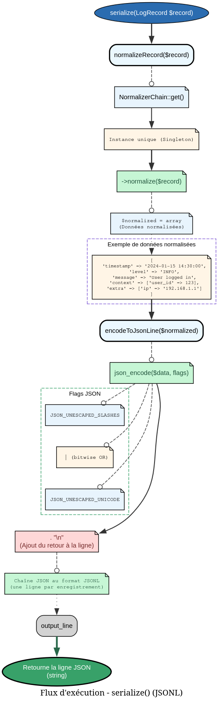
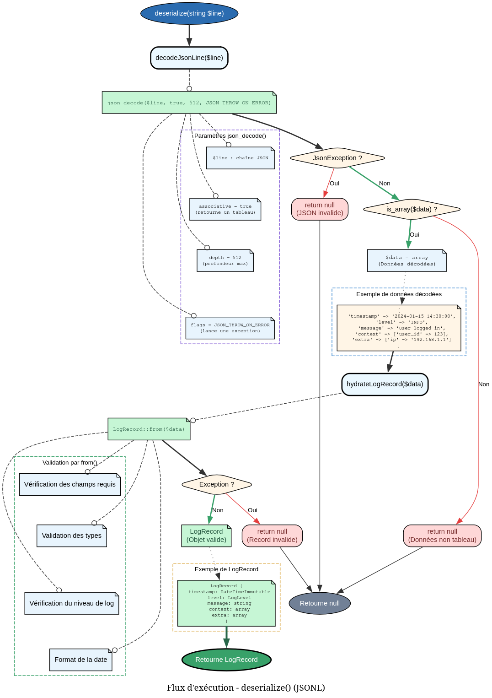

# LogSerializerService - Référence Technique

## Description

Service de sérialisation et désérialisation des enregistrements de logs au format JSON Lines (JSONL). Convertit les objets `LogRecord` en lignes JSON et inversement.

## Hiérarchie

```
Service
    └── LogSerializerService (final)
```

## Rôle principal

Ce service assure la persistance et la récupération des logs en gérant la conversion entre les objets métier et leur représentation textuelle :

- **Sérialisation** : Transformation d'un `LogRecord` en ligne JSONL (avec saut de ligne final)
- **Désérialisation** : Reconstruction d'un `LogRecord` à partir d'une ligne JSONL
- **Validation** : Vérification qu'une ligne JSONL est un log valide sans le reconstruire complètement

Le service utilise le `NormalizerChain` pour la normalisation et l'hydratation native de `AbstractRecord`.

## API / Méthodes publiques

### `serialize(LogRecord $record): string`

Sérialise un enregistrement de log en ligne JSONL.

| Paramètre | Type | Description |
|-----------|------|-------------|
| `$record` | `LogRecord` | L'enregistrement à sérialiser |

**Retourne :** `string` - Ligne JSONL se terminant par `\n`

**Exemple :**
```php
$record = new LogRecord(/* ... */);
$jsonLine = $serializer->serialize($record);
// Résultat: {"time":"2024-01-01T12:00:00Z","level":"info","data":{...}}\n
```

### `deserialize(string $line): ?LogRecord`

Désérialise une ligne JSONL en enregistrement de log.

| Paramètre | Type | Description |
|-----------|------|-------------|
| `$line` | `string` | Ligne JSONL (avec ou sans `\n` final) |

**Retourne :** `LogRecord|null` - L'enregistrement reconstruit, ou `null` si la ligne est invalide

**Exceptions :** Aucune (les erreurs sont capturées et retournent `null`)

**Exemple :**
```php
$jsonLine = '{"time":"2024-01-01T12:00:00Z","level":"info","data":{...}}\n';
$record = $serializer->deserialize($jsonLine);

if ($record === null) {
    echo "Invalid log line";
}
```

### `isValidLogLine(string $line): bool`

Valide qu'une ligne JSONL représente un log correct.

| Paramètre | Type | Description |
|-----------|------|-------------|
| `$line` | `string` | Ligne JSONL à valider |

**Retourne :** `bool` - `true` si la ligne est un log valide, `false` sinon

**Exemple :**
```php
if ($serializer->isValidLogLine($line)) {
    $record = $serializer->deserialize($line);
    $this->processLog($record);
}
```

## Cas d'utilisation

### Cas 1 : Écriture de logs (WriteLogTask)

```php
class WriteLogTask
{
    public function execute(LogRecord $record): void
    {
        $jsonLine = $this->serializer->serialize($record);
        file_put_contents($filePath, $jsonLine, FILE_APPEND | LOCK_EX);
    }
}
```

### Cas 2 : Lecture de logs (StreamLogsTask / QueryLogsTask)

```php
class StreamLogsTask
{
    public function execute(string $date): TypedCollection
    {
        $results = new TypedCollection(LogRecord::class);
        
        foreach ($this->getLogFiles($date) as $file) {
            $lines = file($file->path);
            
            foreach ($lines as $line) {
                $record = $this->serializer->deserialize($line);
                
                if ($record !== null) {
                    $results->add($record);
                }
            }
        }
        
        return $results;
    }
}
```

### Cas 3 : Filtrage préalable sans désérialisation complète

```php
// Parcours de millions de logs : validation rapide avant désérialisation
foreach ($lines as $line) {
    if (!$serializer->isValidLogLine($line)) {
        $errorCount++;
        continue; // Ignorer les lignes corrompues sans overhead
    }
    
    $record = $serializer->deserialize($line);
    $this->processRecord($record);
}
```

### Cas 4 : Export de logs vers un système externe

```php
class LogExporter
{
    public function exportToS3(): void
    {
        $logs = $this->queryLogs();
        $handle = fopen('php://temp', 'w');
        
        foreach ($logs as $log) {
            $line = $this->serializer->serialize($log);
            fwrite($handle, $line);
        }
        
        $this->uploadToS3($handle);
    }
}
```

## Flux d'exécution

### Sérialisation (`serialize`)


### Désérialisation (`deserialize`)



## Gestion des erreurs

Le service ne lève jamais d'exception publique. Toutes les erreurs sont capturées et retournent `null`.

| Situation | Comportement | Retour |
|-----------|--------------|--------|
| JSON mal formé | `json_decode()` avec `JSON_THROW_ON_ERROR` → exception capturée | `null` |
| JSON valide mais pas un tableau | `is_array()` false | `null` |
| Structure du log invalide | `LogRecord::from()` échoue | `null` |
| Type de log level invalide | `LogRecord::from()` échoue | `null` |
| Champs requis manquants | `LogRecord::from()` échoue | `null` |

**Remarque :** L'utilisation de `JSON_THROW_ON_ERROR` garantit que les erreurs JSON sont transformées en `JsonException`, qui est explicitement capturée. Les autres exceptions (`InvalidArgumentException`, `TypeError`, etc.) sont capturées par le bloc `catch (\Exception)`.

## Performance

| Opération | Complexité | Allocation | I/O |
|-----------|------------|------------|-----|
| `serialize()` | O(n) où n = taille du record | Tableau normalisé | Non |
| `deserialize()` | O(n) où n = taille du JSON | Objet LogRecord | Non |
| `isValidLogLine()` | O(n) (désérialisation complète) | Objet temporaire | Non |

**Remarque :** `isValidLogLine()` désérialise entièrement l'objet (même s'il ne le retourne pas). Pour de très gros volumes, il peut être plus efficace de faire une validation légère avec `json_decode()` seulement.

**Optimisations :**
- Les flags JSON `UNESCAPED_SLASHES` et `UNESCAPED_UNICODE` minimisent la taille des sorties
- La profondeur de décodage est limitée à 512 pour éviter les attaques par déni de service

## Compatibilité

| Version PHP | Support |
|-------------|---------|
| PHP 8.2+ | ✅ Complet |
| PHP 8.1 | ✅ Complet |

| Dépendance | Version |
|------------|---------|
| `andydefer/domain-structures` | ≥ 1.13 |
| `LogRecord` | Compatible |
| `NormalizerChain` | Compatible |

## Exemple complet

```php
<?php

declare(strict_types=1);

use AndyDefer\DomainStructures\Utils\StrictDataObject;
use AndyDefer\Logger\Enums\LogLevel;
use AndyDefer\Logger\Records\LogDataRecord;
use AndyDefer\Logger\Records\LogRecord;
use AndyDefer\Logger\Services\LogSerializerService;

$serializer = new LogSerializerService();

// 1. Créer un log
$payload = new StrictDataObject([
    'user_id' => 12345,
    'action' => 'user_login',
    'ip' => '192.168.1.100',
    'success' => true,
]);

$logData = new LogDataRecord(type: 'authentication', payload: $payload);
$record = new LogRecord(
    time: date('Y-m-d\TH:i:s\Z'),
    level: LogLevel::INFO,
    data: $logData,
);

// 2. Sérialiser
$jsonLine = $serializer->serialize($record);
echo "Log écrit: " . $jsonLine;

// 3. Simuler une lecture
$readLine = $jsonLine;
$hydrated = $serializer->deserialize($readLine);

if ($hydrated !== null) {
    echo "Log lu: {$hydrated->data->type}\n";
    echo "Utilisateur: {$hydrated->data->payload->user_id}\n";
    echo "Action: {$hydrated->data->payload->action}\n";
}

// 4. Valider une ligne suspecte
$suspiciousLine = '{"time":"2024-01-01T12:00:00Z","level":"info"}';
if (!$serializer->isValidLogLine($suspiciousLine)) {
    echo "Ligne invalide (champs requis manquants)\n";
}

// Sortie typique :
// Log écrit: {"time":"2024-06-01T14:30:00Z","level":"info","data":{"type":"authentication","payload":{"user_id":12345,"action":"user_login","ip":"192.168.1.100","success":true}}}
// Log lu: authentication
// Utilisateur: 12345
// Action: user_login
// Ligne invalide (champs requis manquants)
```
---