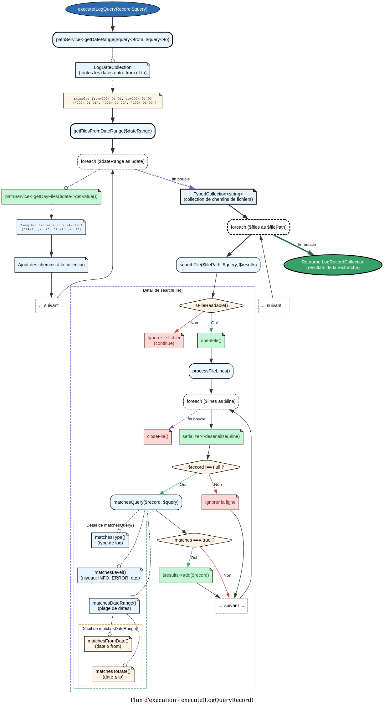

# QueryLogsTask - Référence Technique

## Description

Tâche de requête des enregistrements de logs avec filtres multiples. Permet de rechercher des logs par plage de dates, type d'événement et niveau de sévérité.

## Hiérarchie

```
Task
    └── QueryLogsTask
```

## Rôle principal

Cette tâche exécute des recherches dans les fichiers de logs en appliquant des filtres :

- **Filtrage temporel** : Plage de dates inclusive (de `from` à `to`)
- **Filtrage par type** : Type d'événement (ex: `user_login`, `payment_failed`)
- **Filtrage par niveau** : Niveau de log (`DEBUG`, `INFO`, `WARNING`, `ERROR`)

Les filtres sont combinés de manière AND (tous les critères doivent être satisfaits).

## API / Méthodes publiques

### `__construct(LogPathService $pathService, LogSerializerService $serializer): self`

| Paramètre | Type | Description |
|-----------|------|-------------|
| `$pathService` | `LogPathService` | Service de gestion des chemins |
| `$serializer` | `LogSerializerService` | Service de sérialisation/désérialisation |

### `execute(LogQueryRecord $query): TypedCollection`

Exécute la requête et retourne les logs correspondants.

| Paramètre | Type | Description |
|-----------|------|-------------|
| `$query` | `LogQueryRecord` | Paramètres de la requête (dates, type, niveau) |

**Retourne :** `TypedCollection<LogRecord>` - Collection des logs correspondants

**Exemple :**
```php
$query = new LogQueryRecord(
    from: new IsoZuluTime('2024-01-01T00:00:00Z'),
    to: new IsoZuluTime('2024-01-31T23:59:59Z'),
    type: 'user_login',
    level: LogLevel::INFO,
);

$results = $task->execute($query);
```

## Cas d'utilisation

### Cas 1 : Recherche sans filtres (tous les logs)

```php
$query = new LogQueryRecord(
    from: new IsoZuluTime('2024-01-01T00:00:00Z'),
    to: new IsoZuluTime('2024-01-31T23:59:59Z'),
    type: null,
    level: null,
);

$allLogs = $task->execute($query);
echo "Total logs: {$allLogs->count()}";
```

### Cas 2 : Filtrage par type d'événement

```php
$query = new LogQueryRecord(
    from: $from,
    to: $to,
    type: 'payment_failed',
    level: null,
);

$failedPayments = $task->execute($query);
```

### Cas 3 : Filtrage par niveau de sévérité

```php
$query = new LogQueryRecord(
    from: $from,
    to: $to,
    type: null,
    level: LogLevel::ERROR,
);

$errors = $task->execute($query);
```

### Cas 4 : Filtrage combiné (type + niveau + dates)

```php
$query = new LogQueryRecord(
    from: new IsoZuluTime('2024-01-15T00:00:00Z'),
    to: new IsoZuluTime('2024-01-15T23:59:59Z'),
    type: 'user_login',
    level: LogLevel::WARNING,
);

$suspiciousLogins = $task->execute($query);
```

## Flux d'exécution


## Gestion des erreurs

| Situation | Comportement |
|-----------|--------------|
| Fichier inexistant | Ignoré silencieusement |
| Fichier illisible | Ignoré silencieusement |
| Ligne JSON invalide | Ignorée (continue avec la ligne suivante) |
| Ligne ne contenant pas un LogRecord valide | Ignorée |
| Date de début > date de fin | Collection vide retournée |

## Performance

| Opération | Complexité |
|-----------|------------|
| `getFilesFromDateRange()` | O(d × f) |
| `searchFile()` | O(n) où n = nombre de lignes dans le fichier |
| `matchesQuery()` | O(1) |

- **d** = nombre de jours dans la plage
- **f** = nombre moyen de fichiers par jour
- **n** = nombre de lignes dans un fichier

## Compatibilité

| Version PHP | Support |
|-------------|---------|
| PHP 8.2+ | ✅ Complet |
| PHP 8.1 | ✅ Complet |

## Exemple complet

```php
<?php

declare(strict_types=1);

use AndyDefer\Logger\Tasks\QueryLogsTask;
use AndyDefer\Logger\Services\LogPathService;
use AndyDefer\Logger\Services\LogSerializerService;
use AndyDefer\Logger\Records\LogQueryRecord;
use AndyDefer\Logger\Records\LogRecord;
use AndyDefer\Logger\ValueObjects\IsoZuluTime;
use AndyDefer\Logger\ValueObjects\LoggerConfig;
use AndyDefer\Logger\Enums\LogLevel;

// Configuration
$config = new LoggerConfig('/var/log/myapp', 30);
$pathService = new LogPathService($config);
$serializer = new LogSerializerService();
$queryTask = new QueryLogsTask($pathService, $serializer);

// Rechercher toutes les erreurs du mois de janvier 2024
$from = new IsoZuluTime('2024-01-01T00:00:00Z');
$to = new IsoZuluTime('2024-01-31T23:59:59Z');

$query = new LogQueryRecord(
    from: $from,
    to: $to,
    type: null,
    level: LogLevel::ERROR,
);

$results = $queryTask->execute($query);

echo "Found {$results->count()} errors in January 2024\n";

foreach ($results as $record) {
    echo "[{$record->time->getValue()}] {$record->data->type}: ";
    echo json_encode($record->data->payload->toArray()) . "\n";
}
```
---