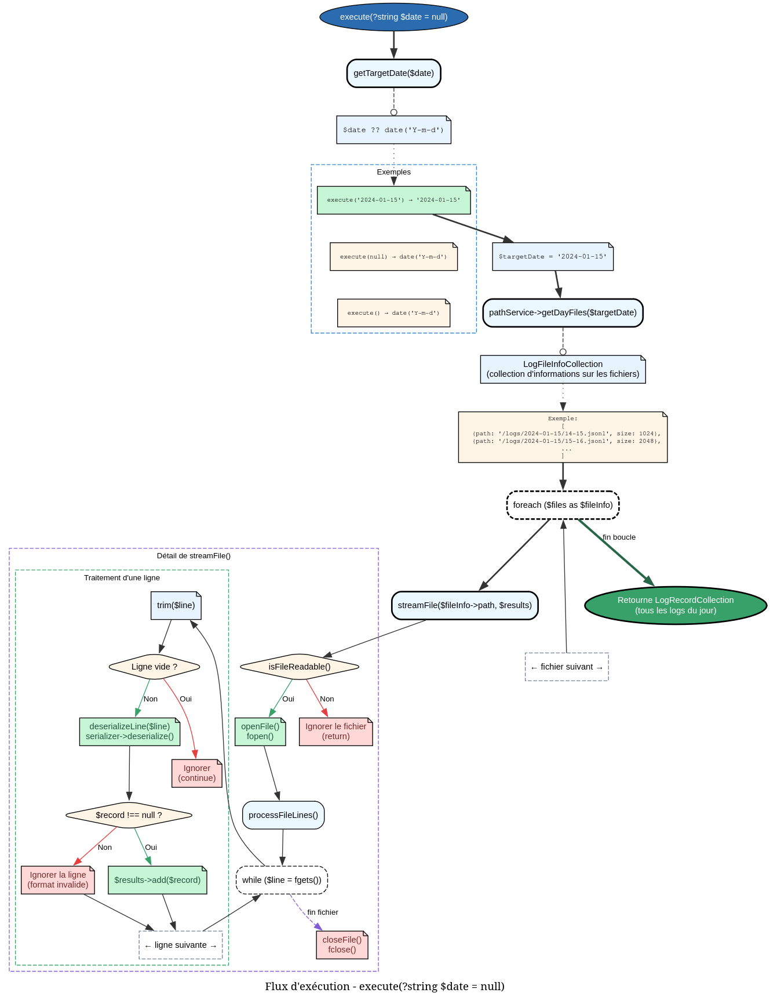

# StreamLogsTask - Référence Technique

## Description

Tâche de streaming de tous les enregistrements de logs pour une date spécifique. Lit l'ensemble des fichiers JSONL d'une journée et retourne une collection de `LogRecord`.

## Hiérarchie

```
Task
    └── StreamLogsTask
```

## Rôle principal

Cette tâche permet d'exporter ou d'analyser l'intégralité des logs d'une journée :

- **Lecture complète** : Tous les fichiers horaires d'une date sont lus
- **Désérialisation automatique** : Conversion des lignes JSON en objets `LogRecord`
- **Gestion des erreurs** : Les lignes invalides sont ignorées silencieusement
- **Performance** : Lecture séquentielle optimisée pour de gros volumes

## API / Méthodes publiques

### `__construct(LogPathService $pathService, LogSerializerService $serializer): self`

| Paramètre | Type | Description |
|-----------|------|-------------|
| `$pathService` | `LogPathService` | Service de gestion des chemins |
| `$serializer` | `LogSerializerService` | Service de sérialisation/désérialisation |

### `execute(?string $date = null): TypedCollection`

Exécute le streaming des logs pour une date donnée.

| Paramètre | Type | Description |
|-----------|------|-------------|
| `$date` | `string|null` | Date au format `YYYY-MM-DD` (utilise la date du jour si null) |

**Retourne :** `TypedCollection<LogRecord>` - Collection de tous les logs de la date

**Exemple :**
```php
// Stream les logs du jour
$todayLogs = $task->execute();

// Stream les logs d'une date spécifique
$logs = $task->execute('2024-01-15');

foreach ($logs as $log) {
    echo $log->time->getValue() . ": " . $log->data->type . "\n";
}
```

## Cas d'utilisation

### Cas 1 : Export quotidien des logs

```php
class LogExporter
{
    public function exportDay(string $date): void
    {
        $logs = $this->streamTask->execute($date);
        $handle = fopen("export_{$date}.jsonl", 'w');
        
        foreach ($logs as $log) {
            fwrite($handle, $this->serializer->serialize($log));
        }
        
        fclose($handle);
        echo "Exported {$logs->count()} logs for {$date}\n";
    }
}
```

### Cas 2 : Analyse des logs du jour

```php
$todayLogs = $streamTask->execute();

$stats = [
    'total' => $todayLogs->count(),
    'errors' => $todayLogs->filter(fn($log) => $log->level === LogLevel::ERROR)->count(),
    'warnings' => $todayLogs->filter(fn($log) => $log->level === LogLevel::WARNING)->count(),
];

echo "Today's logs: {$stats['total']} (Errors: {$stats['errors']})\n";
```

### Cas 3 : Surveillance des logs en temps réel (cron)

```php
// Script exécuté toutes les heures
$lastHour = date('Y-m-d H:00:00');
$logs = $streamTask->execute();

$newErrors = $logs->filter(fn($log) => 
    $log->level === LogLevel::ERROR && 
    $log->time->getDateTime() >= new DateTime($lastHour)
);

if ($newErrors->isNotEmpty()) {
    $this->notifyAdministrator($newErrors);
}
```

### Cas 4 : Nettoyage des anciens exports

```php
class LogArchiveManager
{
    public function archiveMonth(string $yearMonth): void
    {
        $startDate = $yearMonth . '-01';
        $endDate = date('Y-m-t', strtotime($startDate));
        
        $currentDate = $startDate;
        $allLogs = new TypedCollection(LogRecord::class);
        
        while ($currentDate <= $endDate) {
            $dailyLogs = $this->streamTask->execute($currentDate);
            $allLogs->add(...$dailyLogs->toArray());
            $currentDate = date('Y-m-d', strtotime($currentDate . ' +1 day'));
        }
        
        $this->saveToArchive($yearMonth, $allLogs);
    }
}
```

## Flux d'exécution



## Gestion des erreurs

| Situation | Comportement |
|-----------|--------------|
| Répertoire de la date inexistant | Retourne une collection vide |
| Fichier illisible | Ignoré silencieusement |
| Ligne JSON invalide | Ignorée (continue avec la ligne suivante) |
| Ligne ne contenant pas un LogRecord valide | Ignorée |
| Date mal formatée | Traitée comme une string normale (inchangée) |

## Performance

| Opération | Complexité |
|-----------|------------|
| `getDayFiles()` | O(f) |
| `streamFile()` | O(n) où n = nombre de lignes |
| Désérialisation | O(m) où m = taille de chaque ligne |

- **f** = nombre de fichiers horaires pour la date (max 24)
- **n** = nombre total de lignes dans les fichiers

**Recommandations :**
- Pour de très gros volumes, envisager un streaming asynchrone
- La désérialisation est O(n) par fichier

## Compatibilité

| Version PHP | Support |
|-------------|---------|
| PHP 8.2+ | ✅ Complet |
| PHP 8.1 | ✅ Complet |

## Exemple complet

```php
<?php

declare(strict_types=1);

use AndyDefer\Logger\Tasks\StreamLogsTask;
use AndyDefer\Logger\Services\LogPathService;
use AndyDefer\Logger\Services\LogSerializerService;
use AndyDefer\Logger\ValueObjects\LoggerConfig;
use AndyDefer\Logger\ValueObjects\IsoZuluTime;
use AndyDefer\Logger\Enums\LogLevel;

// Configuration
$config = new LoggerConfig('/var/log/myapp', 30);
$pathService = new LogPathService($config);
$serializer = new LogSerializerService();
$streamTask = new StreamLogsTask($pathService, $serializer);

// 1. Récupérer tous les logs d'aujourd'hui
$todayLogs = $streamTask->execute();

echo "=== Today's Logs ===\n";
echo "Total: {$todayLogs->count()}\n\n";

// 2. Analyser les erreurs
$errors = $todayLogs->filter(fn($log) => $log->level === LogLevel::ERROR);

echo "=== Errors Today ===\n";
foreach ($errors as $error) {
    echo "[{$error->time->getValue()}] {$error->data->type}\n";
    echo "  Payload: " . json_encode($error->data->payload->toArray()) . "\n";
}

// 3. Analyser les logs d'une date spécifique
$specificDate = '2024-01-15';
$logs = $streamTask->execute($specificDate);

echo "\n=== Logs for {$specificDate} ===\n";
echo "Total: {$logs->count()}\n";

$byType = [];
foreach ($logs as $log) {
    $byType[$log->data->type] = ($byType[$log->data->type] ?? 0) + 1;
}

foreach ($byType as $type => $count) {
    echo "  {$type}: {$count}\n";
}

// Exemple de sortie :
// === Today's Logs ===
// Total: 1523
//
// === Errors Today ===
// [2024-01-15T14:23:45Z] payment_failed
//   Payload: {"payment_id":12345,"amount":99.99}
// [2024-01-15T16:12:03Z] database_connection
//   Payload: {"error":"Connection refused","retry":3}
//
// === Logs for 2024-01-15 ===
// Total: 1523
//   user_login: 845
//   payment_failed: 12
//   database_connection: 3
//   api_call: 663
```
---