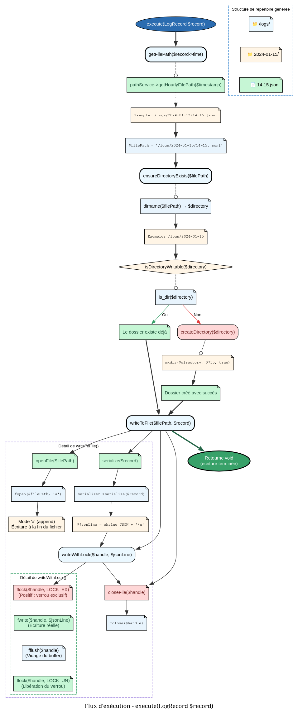

# WriteLogTask - Référence Technique

## Description

Tâche d'écriture des enregistrements de logs sur le disque. Gère la génération des chemins, la création des répertoires et l'écriture atomique avec verrouillage exclusif.

## Hiérarchie

```
Task
    └── WriteLogTask
```

## Rôle principal

Cette tâche assure la persistance des logs de manière fiable et performante :

- **Génération de chemins** : Construction du chemin basé sur le timestamp (bucketisation horaire)
- **Création de répertoires** : Création automatique de la structure de dossiers
- **Écriture atomique** : Verrouillage exclusif (`LOCK_EX`) pour éviter la corruption en environnement concurrent
- **Bufferisation implicite** : Les écritures sont immédiates (pas de buffer interne)

## API / Méthodes publiques

### `__construct(LogPathService $pathService, LogSerializerService $serializer): self`

| Paramètre | Type | Description |
|-----------|------|-------------|
| `$pathService` | `LogPathService` | Service de gestion des chemins |
| `$serializer` | `LogSerializerService` | Service de sérialisation JSON |

### `execute(LogRecord $record): void`

Écrit un enregistrement de log sur le disque.

| Paramètre | Type | Description |
|-----------|------|-------------|
| `$record` | `LogRecord` | Enregistrement à écrire |

**Exceptions :** `RuntimeException` si le répertoire ou le fichier ne peut pas être créé/ouvert

**Exemple :**
```php
$record = new LogRecord(/* ... */);
$task->execute($record);
```

### `getFilePath(IsoZuluTime $timestamp): string`

Calcule le chemin du fichier pour un timestamp donné.

| Paramètre | Type | Description |
|-----------|------|-------------|
| `$timestamp` | `IsoZuluTime` | Timestamp du log |

**Retourne :** `string` - Chemin absolu du fichier

**Exemple :**
```php
$path = $task->getFilePath($record->time);
// /var/log/structured/2024-01-15/14-15.jsonl
```

### `serialize(LogRecord $record): string`

Sérialise un enregistrement de log en ligne JSON.

| Paramètre | Type | Description |
|-----------|------|-------------|
| `$record` | `LogRecord` | Enregistrement à sérialiser |

**Retourne :** `string` - Ligne JSON se terminant par `\n`

**Exemple :**
```php
$jsonLine = $task->serialize($record);
// {"time":"2024-01-15T14:30:00Z","level":"info","data":{...}}\n
```

## Cas d'utilisation

### Cas 1 : Écriture simple d'un log

```php
$record = new LogRecord(
    time: new IsoZuluTime('2024-01-15T14:30:00Z'),
    level: LogLevel::INFO,
    data: $logData,
);

$writeTask->execute($record);
```

### Cas 2 : Écriture dans le buffer (LogBufferService)

```php
// Le buffer utilise WriteLogTask pour l'écriture réelle
class LogBufferService
{
    public function flush(): void
    {
        foreach ($this->buffer as $record) {
            $this->writeTask->execute($record);
        }
    }
}
```

### Cas 3 : Écriture batch optimisée

```php
// Regroupement par fichier avant écriture
$grouped = [];
foreach ($records as $record) {
    $filePath = $this->writeTask->getFilePath($record->time);
    $grouped[$filePath][] = $record;
}

foreach ($grouped as $filePath => $batch) {
    foreach ($batch as $record) {
        $this->writeTask->execute($record);
    }
}
```

### Cas 4 : Écriture dans un environnement concurrent

```php
// Plusieurs processus peuvent écrire simultanément
// Le verrouillage exclusif garantit l'intégrité des données
$writeTask->execute($record1); // Process A
$writeTask->execute($record2); // Process B (attend que A libère le verrou)
```

## Flux d'exécution



## Règle de bucketisation horaire

| Heure du log | Fichier de destination |
|--------------|------------------------|
| 00:00 - 00:59 | `00-01.jsonl` |
| 01:00 - 01:59 | `01-02.jsonl` |
| ... | ... |
| 22:00 - 22:59 | `22-23.jsonl` |
| 23:00 - 23:59 | `23-00.jsonl` |

**Structure de répertoires :**
```
{basePath}/
    └── 2024-01-15/
        ├── 00-01.jsonl
        ├── 01-02.jsonl
        ├── ...
        └── 23-00.jsonl
```

## Gestion des erreurs

| Situation | Comportement | Exception |
|-----------|--------------|-----------|
| Répertoire inexistant | Tentative de création | `RuntimeException` si échec |
| Permission refusée pour mkdir | Création impossible | `RuntimeException` |
| Fichier non ouvrable | fopen échoue | `RuntimeException` |
| Verrou impossible | flock échoue | L'écriture continue sans verrou ⚠️ |
| Échec d'écriture | fwrite échoue | Ignoré silencieusement |

⚠️ **Note sur le verrouillage :** Si `flock()` échoue, l'écriture est tout de même tentée. En production, ce cas est extrêmement rare.

## Performance

| Opération | Complexité | I/O |
|-----------|------------|-----|
| `getFilePath()` | O(1) | Non |
| `ensureDirectoryExists()` | O(1) (stat) | Oui (si répertoire absent) |
| `serialize()` | O(n) où n = taille du record | Non |
| `writeToFile()` | O(1) (append) | Oui |
| Verrouillage exclusif | O(1) | Non (mais attend si verrouillé) |

**Recommandations :**
- Utiliser `LogBufferService` pour les écritures en masse
- Éviter d'appeler `execute()` en boucle sans buffer
- Le verrouillage peut créer des goulots d'étranglement sous forte charge

## Compatibilité

| Version PHP | Support |
|-------------|---------|
| PHP 8.2+ | ✅ Complet |
| PHP 8.1 | ✅ Complet |

## Exemple complet

```php
<?php

declare(strict_types=1);

use AndyDefer\Logger\Tasks\WriteLogTask;
use AndyDefer\Logger\Services\LogPathService;
use AndyDefer\Logger\Services\LogSerializerService;
use AndyDefer\Logger\Records\LogDataRecord;
use AndyDefer\Logger\Records\LogRecord;
use AndyDefer\Logger\ValueObjects\IsoZuluTime;
use AndyDefer\Logger\ValueObjects\LoggerConfig;
use AndyDefer\Logger\Enums\LogLevel;
use AndyDefer\DomainStructures\Utils\StrictDataObject;

// Configuration
$config = new LoggerConfig('/var/log/myapp', 30);
$pathService = new LogPathService($config);
$serializer = new LogSerializerService();
$writeTask = new WriteLogTask($pathService, $serializer);

// Créer un log
$payload = new StrictDataObject([
    'user_id' => 12345,
    'action' => 'login',
    'ip' => '192.168.1.100',
    'success' => true,
]);

$logData = new LogDataRecord(type: 'authentication', payload: $payload);
$record = new LogRecord(
    time: new IsoZuluTime('2024-01-15T14:30:00Z'),
    level: LogLevel::INFO,
    data: $logData,
);

// Écrire le log
try {
    $writeTask->execute($record);
    echo "Log écrit avec succès\n";
    echo "Chemin: " . $writeTask->getFilePath($record->time) . "\n";
} catch (RuntimeException $e) {
    echo "Erreur: " . $e->getMessage() . "\n";
}

// Sortie typique :
// Log écrit avec succès
// Chemin: /var/log/myapp/2024-01-15/14-15.jsonl
```
---